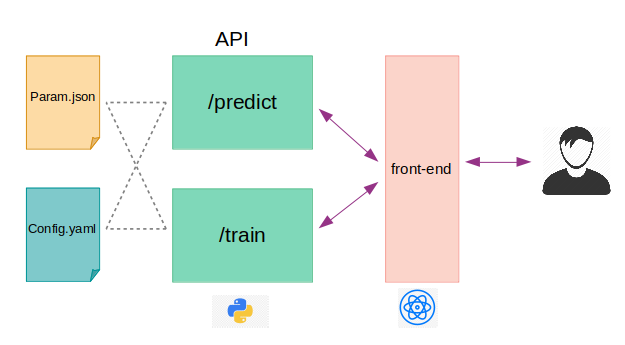

# Full Stack Deep Learning Model

This repository is a starter-kit for deploying a deep lelarning model. The 
objective is to create a `seq2seq` model in pytorch and expose the prediction
as a `REST API` using python `flask` module.

The code is broken into 2 pieces. Mainly

- train_API.py
- predict_API.py
- config.yaml
- param.json

Currently `train_API.py` is not ready. It's only available as a vanila `train.py`
file which saves the model in the appropriate folder. A `train/` API will be added 
later. However the `predict_API.py` is ready. The original `predic.py` is 
available in folder `99_testdir/`. The flask API `/predict` is added on top of it
and `predict_API.py` is created. Also some basic logging feature is added in the
api for easy debugging. 

The `config.yaml` contains all the meta information for the project. The directory 
structure and the API ip and port information.

## Application Archtecture

## Main Scripts

+ The `predict_API.py` holds the actual code for prediciton module for the `/predict` api.

## Start the PREDICTION SERVER (/predict API):

+ `python predict_API.R`

## Run the client from terminal

+ following curl command can be used:
    + Syntax
	  + ` curl http://localhost:5000/predict --data '[{"UID":"1","AGE":"15"}]' -H "Content-Type: application/json" ` 
	  + `/predict` is the prediction API end point

## TODO

1. update the `train_api.py`
2. update the curl syntax for prediction
3. update the README.md
